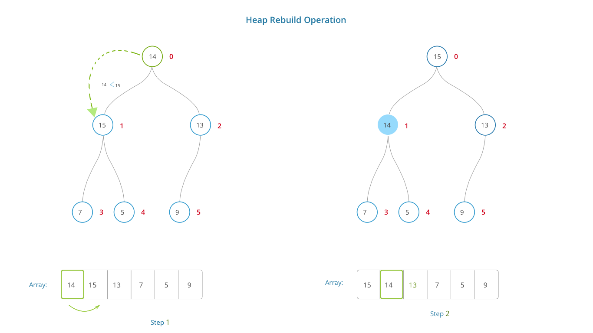

### Theory of Rebuilding Heap

The root node is compared with both the children and swapped with the lowest child if it is greater else left unchanged. This process is done for all the nodes until a heap is obtained.
### Algorithmic Description of Rebuilding the Heap (with Max Heap)

Rebuilding a heap is a process through which we do some swapping of array elements to make the tree satisy the heap property which is disturbed by replacing the root element. Rebuilding of heap takes O(logN) steps and each time we ensure that the parent is smaller than both the children if its minheap or bigger if its a maxheap.
### Pictorial Representation of Rebuild Heap

