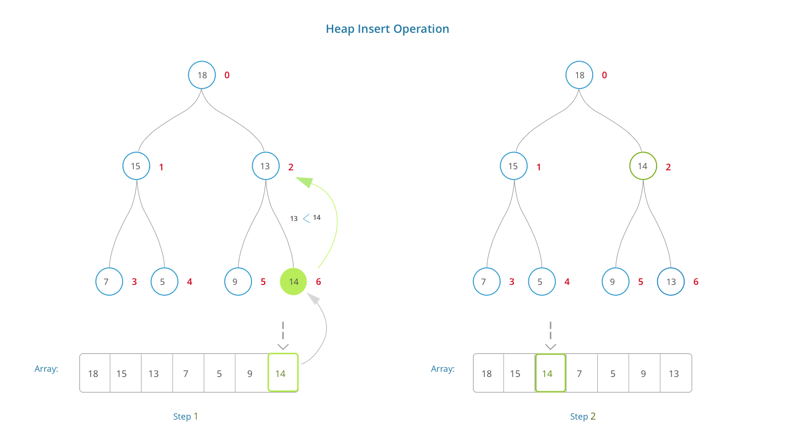

### Theory of Insert Heap

In min heap the parent node is always less than both its children. In a max heap the parent node is always greater than both its children.

### Algorithmic Description of Insert Heap

Building a heap is a process through which an array of elements in any given order is converted to a min heap or a max heap.
Followings are the steps to insert elements into Heap:

   - Input array A with n elements.
   - One by one, the array elements are inserted into e heap at the leaf position.
   - After every insersion heap property is checked and if heap propety is violated, then we shift up the inserted element to get a heap.

### Pictorial Representation of Insert Heap Operation 

