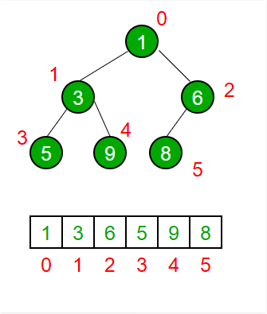

### Theory of Extract Min Operation

The root that is the top most node is removed and the last element is moved in its place as the new root. Last element in the binary tree is moved as the new root and the root is placed in a sorted array

### Pictorial Representation of Extract Min Operation

